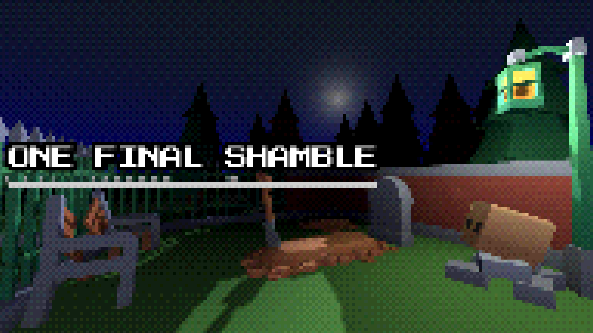

> ⚠️ Due to lack of time, I never finished this! The repo is kept as a "lessons learned".

*They say that once in a blue moon, a deceased soul is given one final chance to return to the living world.*

*One last stand.*

***One final shamble.***

~ *If they make it out, that is.*

## How to play

The goal is simple - make your way out of the cemetery. Kudos if you're fast about it!

### Mechanics

🪦 Hide in graves!

🔨 Smack caretakers with shovels!

🎃 Put pumpkins on your head as a disguise!

### Controls

* WASD - move
* Mouse - control camera
* E - interact

## Some background

This game was intended for the GameDev.tv Jam 2024. Due to work and life constraints I was unable to complete the game.

* Developed using Godot 4.2
* Uses Kenney assets (Graveyard Kit, Particles Pack)
* Game idea by spitballing with my partner, Sara ❤️